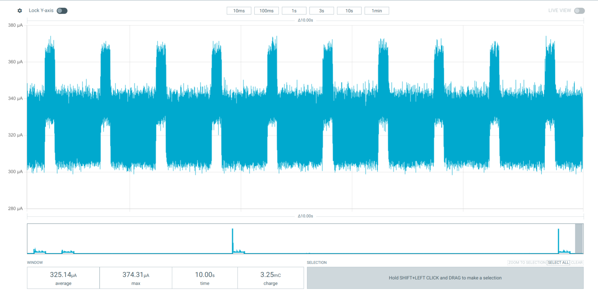
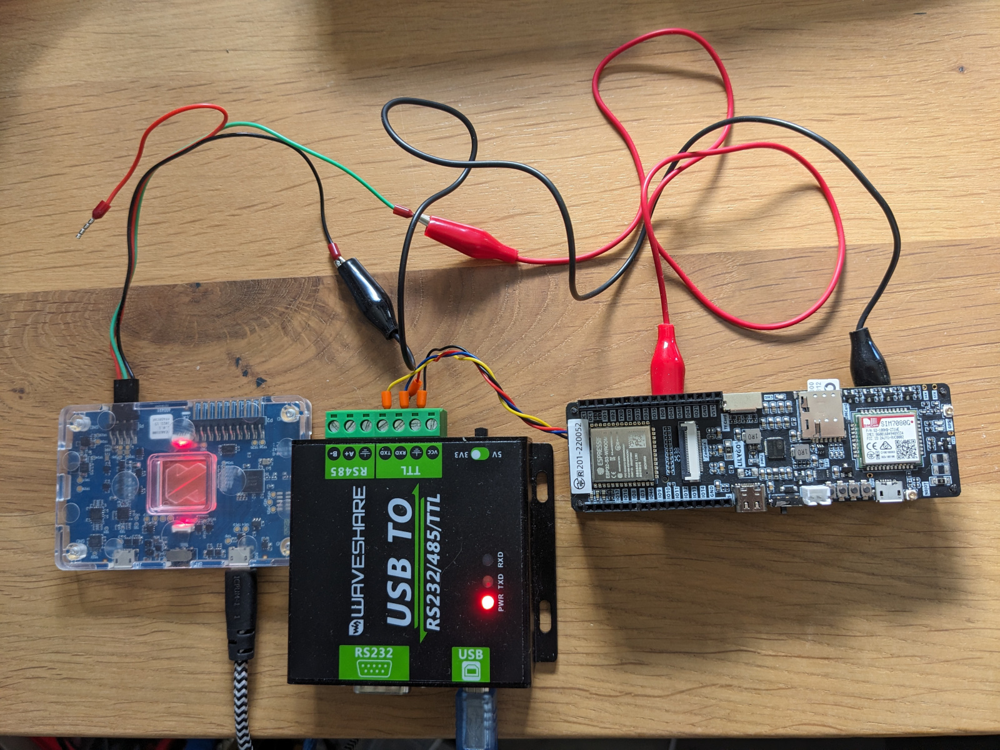

# Low Power Extreme Test (ESP32-S3 + AXP2101)

This project is a simple low-power test setup for ESP32-S3 (LilyGo T-SIM 7080G style hardware) using ESP-IDF via PlatformIO.

The main goal is to initialize required peripherals, prepare PMU rails, and enter deep sleep with wakeup sources disabled.

## Result

The setup was able to reach **325 uA** in deep sleep.



## Basic Connection

Reference wiring/photo:



## What This Firmware Does

- Initializes I2C with ESP-IDF new I2C master API.
- Initializes AXP2101 PMU (XPowersLib).
- Configures PMU for low-power sleep behavior.
- Powers down modem over UART (AT command sequence).
- Resets selected GPIOs to safe input/pulldown states.
- Disables all sleep wakeup sources.
- Enters deep sleep.

## Project Structure

- `src/main.cpp` - main application logic (PMU + sleep flow)
- `platformio.ini` - PlatformIO environment and build flags
- `image/` - documentation images

## Build

```bash
platformio run
```

## Upload

```bash
platformio run --target upload
```

## Notes

- XPowersLib is used with the ESP-IDF new API path enabled in build flags.
- Log level is set for easier bring-up/debug during testing.
